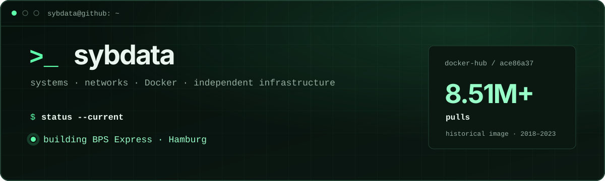

<p align="center">
  
</p>

<p align="center">
  <a href="https://bps.express/">BPS Express</a> ·
  <a href="https://sybdata.github.io/">Technical archive</a> ·
  <a href="https://hub.docker.com/u/sybdata">Docker Hub</a>
</p>

## `$ whoami`

I’m Aleksandr, a systems and infrastructure builder based in Hamburg. My background in networks, Docker, and self-hosted services shapes how I approach technology: understand how it works, not how it is marketed.

Today I’m building [**BPS Express**](https://bps.express/) — an independent author project about European sports technology, quality, and conscious choice.

## `$ ls projects/`

| Project | Description | Status |
| --- | --- | --- |
| [**bps.express/**](https://bps.express/) | Independent editorial project and digital home | `current` |
| [**bps-onchain-commerce/**](https://github.com/sybdata/bps-onchain-commerce) | Verified USDC commerce lab on Base | `new` |
| [**onchain-order/**](https://github.com/sybdata/onchain-order) | Next.js onchain ordering prototype | `new` |
| [**sybdata.github.io/**](https://sybdata.github.io/) | Systems notes and technical archive | `maintained` |

## `$ ls infrastructure/`

- [**vpn.bps.express/**](https://vpn.bps.express/) — WireGuard + AmneziaWG lab
- [**mail.id500.de/**](https://mail.id500.de/) — mailcow production mail server
- [**docker-hub/**](https://hub.docker.com/u/sybdata) — public container images

## `$ docker-hub stats sybdata/ace86a37`

> [**8.51M+ pulls**](https://hub.docker.com/r/sybdata/ace86a37)<br>
> Historical public image · published 2018–2023

```text
$ principles
build independently · label history honestly · keep the web useful
```

<p align="center">
  <sub>Systems · networks · containers · self-hosting · onchain experiments</sub>
</p>
